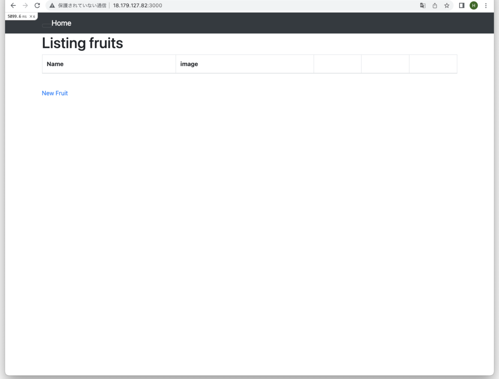
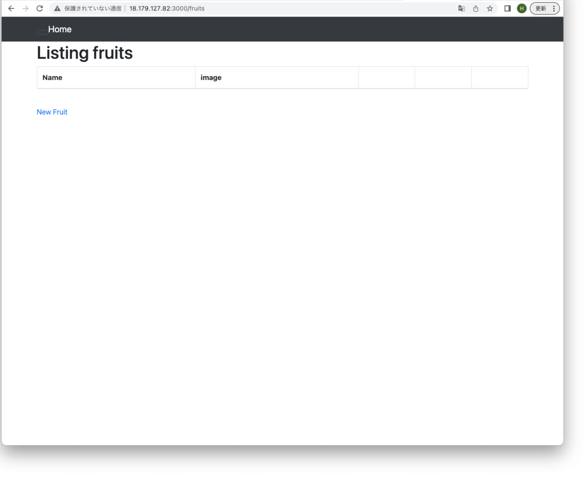
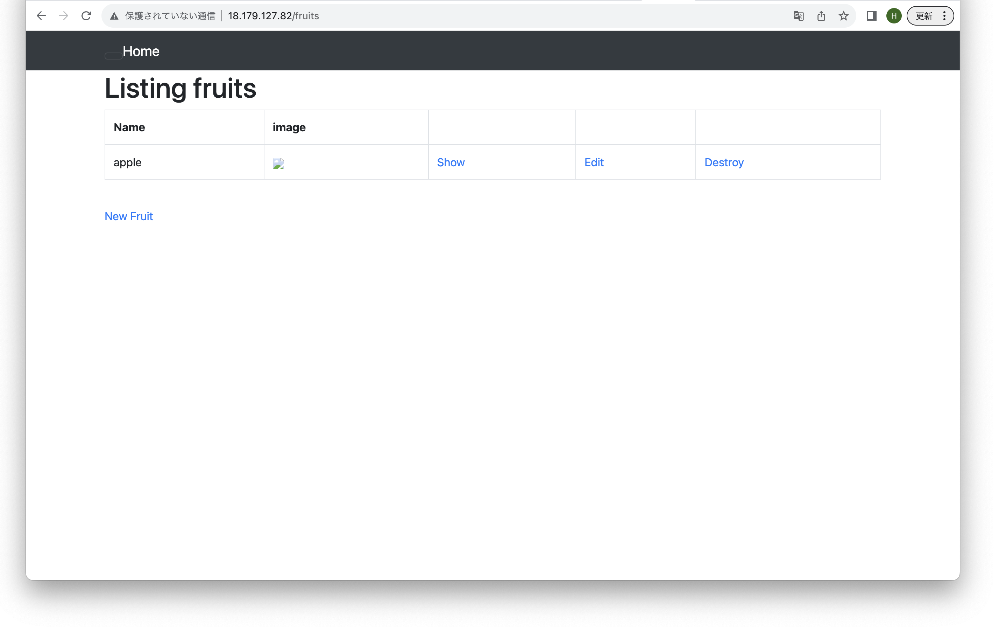
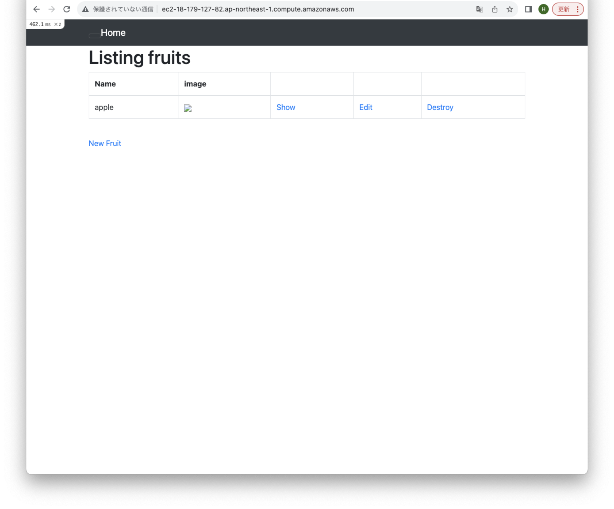
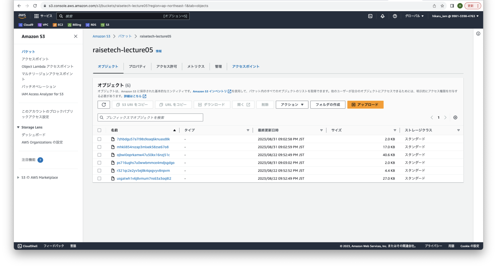
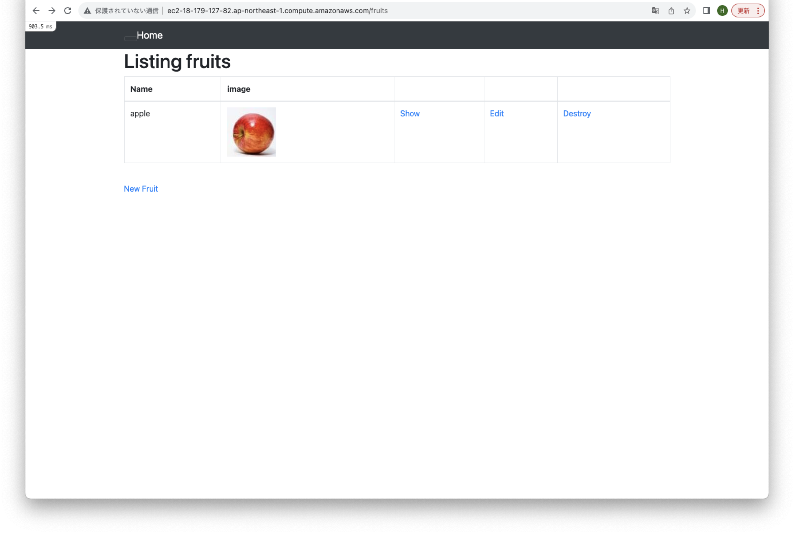
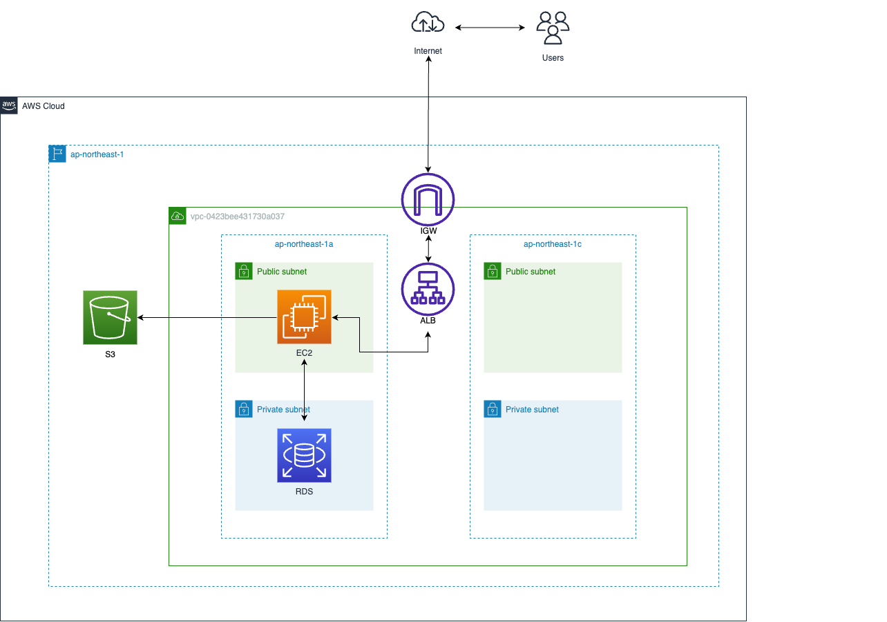

# AWS第5回課題
- 組み込みサーバーのみで起動

- Unicornを用いて起動

- UnicornとNginxで起動

- ロードバランサーを作成して起動

- S3の作成

- S3をアプリケーションの画像データ保存先として使用し、アプリケーションを起動
 - ※先ほどまではアプリケーション上で画像のサムネイルが表示されなかったが、S3を導入すると表示されるようになった. これの理由については現時点でわからないため今後の課題。 

- 構成図の作成
